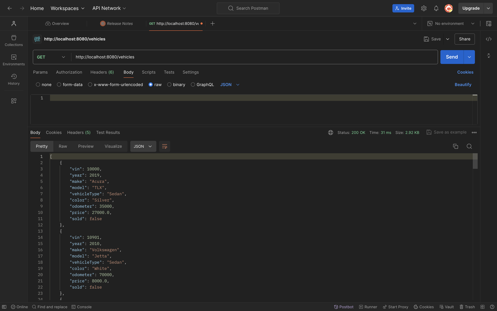
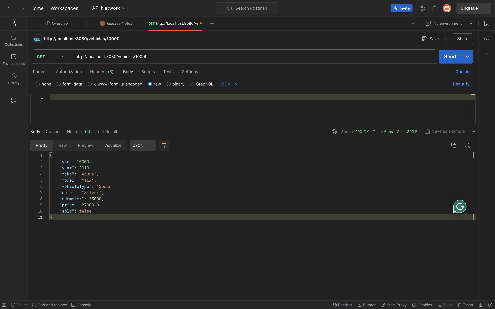

# Workshop Nine

## Project Description

This project focuses on creating a Java Spring Boot application that connects to a MySQL database. The application serves as a dealership API, allowing users to interact with vehicle and  contract data.

## Code Snippets Working in Postman

### Vehicles

- **Get All Vehicles**

  
Request and Response in Postman

- **Get One Vehicle by VIN (ID)**

  
Request and Response in Postman

### Errors I encountered
`` My get request for the lease contract and sales contract was experiencing crashing.
I  also experienced a lot of crashing with the vehicles data however I was able to get full crud and 
the search is a work in progress.``

